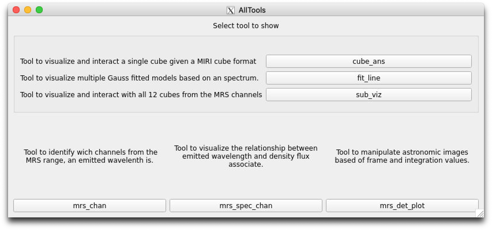

.. _all_tools_tutorial:

==================
All_tools Tutorial
==================

--------
Overview
--------
All_tools allow to execute each one of the tools created from it's main window.

------------
Requirements
------------

* Python (tested for 3.8.0)
* Matplotlib (tested for 3.1.2)
* Numpy (tested for 1.81.1)
* Numpy (tested for 5.14.0)
* PyQt5 8tested for 5.14.0)
* Seaborn (tested for 0.9.0)
* Lmfit (tested for 1.0.0)
* PyPubSub (tested for 4.0.3)

-------------------
Main window display
-------------------
The tool consist in one window that cointains one button and a description for each tool made, appart from this one (see :numref:`figure1_allTools`).
After one of the buttons has been pressed, the tool associated with that button will load, with the possibility to press more buttons to load all the different tools that appear on the window.

.. _figure1_allTools:

