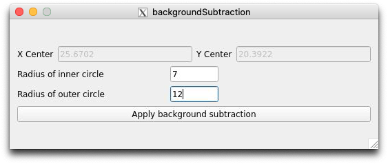
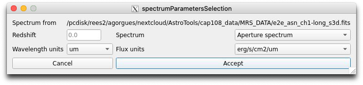

.. _cube_ans_tutorial:

Cube Ans Tutorial
=================

Overview
--------

Cube_Ans allows to represent a galaxy cube that comes from a MIRI, MUSE or MEGARA cube structure in form of an image for each slice with the options to move through each one.
Based on the image represented, an aperture operation along with the background subtraction operation can be made on it, showing different spectra along all the slices, with the posibility to represent it in the fit_line tool.

.. note::
        Only works with the MIRI, MUSE or MEGARA Cube format

Requirements
-------------

To execute and use the too, the next libraries need to be installed:

* Python (tested for 3.8.0)
* Matplotlib (tested for 3.1.2)
* Numpy (tested for 1.81.1)
* PyQt5 (tested for 5.14.0)
* Seaborn (tested for 0.9.0)
* Lmfit (tested for 1.0.0)
* PyPubSub (tested for 4.0.3)
* Photutils (tested for 1.1.0)
* jwst (tested for 1.3.2)

Initial display
---------------

After the tool is loaded, a window with a menu bar and several buttons in it at the top of it will appear which will interact with the images on the canvas.

Data insertion
--------------

To be able to interact with the images the "Open" button in the "File" menu option on the top left of the window need to be pressed, showing a new window which will allow to select the type of cube that is going be loaded. The selection of the cube is necessary because of the different headers that each cube has (see :numref:`figure1_cube_ans`).

.. _figure1_cube_ans:

Data interaction
----------------

Once the cube has been selected, the first slice, which corresponds to the first wavelenght, will appear on the canvas (see :numref:`figure2_cube_ans`). Using the top components, the slice can be changed with:

* An slider that has a range determinated from the minimum and máximum value of the wavelength. Once it has been moved, the "Slice Value" spin, the "Wavelength Value" text edit field and the current image will changed with it's associated values based on the current wavelength, slice values and image index.
* An spin that can be used to changed to the slice that want to be shown. As told before, once this field change, the other components related will change too.
* A text field that can be used to change to the slice that want to be shown based on the approximated wavelength value. After this file change, the other componentes will change too.

.. _figure2_cube_ans:

.. _Image manipulation cubeAns:

Image manipulation
^^^^^^^^^^^^^^^^^^

The "Tools" option in the menu bar contains multiple sections related to different actions (see :numref:`figure3_cube_ans`). In this section, the first part contains different choices to manipulate the images:

* The Unselect option which disallow the current option selected.
* The Zoom option allow to make zoom to the current image with the mouse wheel and maintain that zoom along all the slices
* The Pan option allow to move the current image with the left mouse button and maintain that shift alonw all the slices.
* The Zoom reset option allow to show the image as it was initially
* The Rectangle aperture and Ellipse aperture options allow to select an area based on the type of figure and make the aperture to obtain the associated spectrum. This complete process will be explained in the `Rectangle manipulation`_ and `Ellipse manipulation`_ sections.
* The Creation of the rectangle and ellipse paremeterized options allow to implement the aperture as the option before but in this case, the figure is created based on the pixel coordinates inserted previously. This complete process will be explained in the `Rectangle manipulation`_ and `Ellipse manipulation`_ section.
* The Rectangle coordinates and Ellipse coordinates options allow to see the coordinates in pixels of each of the figure.
* The Spectrum visualization option allow to see, if the window was closed before, the spectra made from the aperture and background operations. This complete process will be explained in the `Background subtraction cubeAns`_ section.
* The Background subtraction option allow to obtain the spectrum as a result of the background subtraction from the aperture made initially and the annulus aperture made through this process along with the spectrum made from this annulus apperture, whose complete functionality will be explained in the `Background subtraction cubeAns`_ section.

.. _figure3_cube_ans:

Style manipulation
^^^^^^^^^^^^^^^^^^
The third option listed on the top bar corresponds to the style which allows to change the scale, stretch and color of the current image displayed (see :numref:`figure4_cube_ans`):

* The Color of the image can be change with a palette of them like Accent or CoolWarm
* The Scale of the image can be set to show it with a Min-Max interval or a ZScale
* The Stretch of the image can be set to use a sqrt, log or linear stretch.

.. _figure4_cube_ans:

Rectangle manipulation
^^^^^^^^^^^^^^^^^^^^^^
Related to the rectangle manipulation, three options can be selected:

1. The "Rectangle aperture" option, which allow to obtain the aperture spectrum associated to the rectangle area.
   After the option has been selected, the rectangle figure will be able to be drawn manually on the current image (see :numref:`figure5_cube_ans`). Once the figure has been created, a new window will appear, showing the spectrum associated to the aperture along with different buttons, whose functionality will be explained in the `Spectrum visualization cubeAns`_ section.
2. The "Rectangle Coordinates" option will show a new window that contains the X and Y coordinates of the left, right, top and bottom side of the rectangle, which will update when the figure change (see :numref:`figure6_cube_ans`).
3. The "Creation of Rectangle parameterized" option will allow to update or create in a new window the same rectangle figure as the one created in the first point, given the coordinates in pixels. The figure can be created or updated using the bottom left or the center coordinates along with the height and the width, which can be written in it's associated text fields. Once the parameters had been written, the button located at the bottom of the window will update the coordinates of it (see :numref:`figure7_cube_ans`).

.. _figure5_cube_ans:

|

.. _figure6_cube_ans:

|

.. _figure7_cube_ans:

Ellipse manipulation
^^^^^^^^^^^^^^^^^^^^
Related to the ellipse manipulation, three options can be selected:

1. The "Ellipse aperture" option, which allow to obtain the aperture spectrum associated to the ellipse area.
   After the option has been selected, the ellipse figure will be able to be drawn manually on the current image. Once the figure has been created, a new window will appear, showing the spectrum associated to the aperture along with different buttons, whose functionality will be explained in the `Spectrum visualization cubeAns`_ section.
2. The "Ellipse Coordinates" option will show a new window that contains the X and Y coordinates of the top and bottom side of the ellipse, and the value in pixels of the major and minor axis, which will update when the figure change.
3. The "Creation of Ellipse parameterized" option will allow to update or create in a new window the same ellipse figure as the one created in the first point, given the coordinates in pixels. The figure can be created or updated using the center coordinates along with the size of the major and minor axis, which can be written in it's associated text fields. Once the parameters had been written, the button located at the bottom of the window will update the coordinates of it.

.. _Spectrum visualization cubeAns:

Spectrum visualization
^^^^^^^^^^^^^^^^^^^^^^

As told before, an spectrum or spectra will appear, which corresponds to the representation of each aperture or background for each wavelength(see :numref:`figure8_cube_ans`). By default the zoom and pan are active in order to use them with the mouse wheel and the left click mouse correspondingly.

Along with the spectra, a vertical black line appears that matches the current wavelength

Below the representation, several buttons appears:

1. The "Select area for collapse image" and "Move range are for collapse image" buttons allow to obtain the total sum of each pixel from each wavelength value in a rectangular area in a new window, pressing manually the initial and final wavelength values as well as pressing the figure once created to move along the wavelength axis (see :numref:`figure9_cube_ans`).
2. The "Show image from wavelength range" button allow to show the image created before in case it has been closed previously
3. The "Save as png" button and "Save spectra as txt" button allows to capture in a PNG file the current plot and to get the spectra as a txt file that contains different columns depending on the number of spectra represented. The second file then can be used on the fit_line or quick_viz tool.
4. The "Show image from wavelength range" button allow to load the spectrum selected into the fit_line tool. To make it possible, a new window will appear which require to select the redshift that will be applied to both wavelength and flux values and the units that are originally because a conversion to X and Y are gonna be applied. This process follows the same structure as if an spectrum would be loaded using the fit_line tool with the exception of the colums where both values are, that in this case are not needed. Once all had been selected, pressing the "Accept" button will apply the changes and the result will be shown in the main window of fit_line.
5. The "Load spectrum on fitLine" button allow to import directly the spectrum selected from the range of the three avaliable into the fitLine  (see :numref:`figure10_cube_ans`).

.. _figure8_cube_ans:

|

.. _figure9_cube_ans:

|

.. _figure10_cube_ans:
.. figure:: _static/cubeAns/cubeAns-re10.png

.. _Background subtraction cubeAns:

Background subtraction
^^^^^^^^^^^^^^^^^^^^^^

Another feature is the possibility to obtain the spectrum resulting from the subtraction of a background delimited parametrically from the spectrum of the aperture created manually. In order to delimite the area of the background, the initial aperture must have been drawn, and then an annulus aperture will be created to implement the background operation. The position in pixels of both rings to perform the annulus aperture will be written in the next window after pressing the "Background subtraction" option in the menu (see :numref:`figure11_cube_ans`). As a result, two new spectra will appear on the spectrumVisualization window, where the red one corresponds to the annulus aperture, an the green one to the background subtraction (see :numref:`figure12_cube_ans`), and two new figures will appear in the main window showing the rings (see :numref:`figure13_cube_ans`).

.. _figure11_cube_ans:

|

.. _figure12_cube_ans:

|

.. _figure13_cube_ans:

Everytime the figure is moved or resized or changed (from rectangle, ellipse or the rings), the previous spectrums will change in order to adjust to the new values.

Example
-------

.. note::
        The file called "e2e_asn_ch1-long_s3d.fits" located in the templates section had been used.

This first example shows the whole process to obtain the background spectrum as a result of the subtraction in the fit_line tool.

After the cube have been loaded, the next part consists of getting the aperture for an specific area. In order to know the area to be selected, the color of the image has been changed into the rainbow color (see :numref:`figure14_cube_ans`), then the rectangle figure for the aperture has been selected to draw it, and the aperture spectrum, obtained (see :numref:`figure15_cube_ans`).

.. _figure14_cube_ans:

|

.. _figure15_cube_ans:

Once the aperture spectrum is drawn, the background subtraction from the rectangle figure using the annulus can be made selecting its associated option in the menu. In this case, while the figure has already been drawn, both radius for the annulus aperture are not, for that, the radius of the rings have been set to 7 and 12 (see :numref: `figure16_cube_ans`).

.. note::
        To be able to create both rings and to make the background subtraction, the "Background subtraction" button from the "Tools" option located in the menu bar was selected.

.. _figure16_cube_ans:

Once both rings have been drawned, the "Apply background subtraction" button need to be pressed. This action will update the window that shows the initial spectrum with two more, the red and green one, that corresponds to the mean flux value of the background for each wavelength and the subtraction of the background aperture area from the initial spectrum (see :numref:`figure17_cube_ans`).

.. _figure17_cube_ans:

In order to load the fit_line tool, the "Load spectrum on fitLine" button from the previous window need to be pressed, which will show the last window associated to set the desired paramaters that are gonna be represented in the fit_line too. In this example, the redshift value has been set to 0.0 and the units of the wavelength and flux parameters to X and Y respectively (see :numref:`figure18_cube_ans`). After all actions have been made, the "Accept" button is pressed, and the fit_line tool appear, showing the spectrum (see :numref:`figure19_cube_ans`).

.. _figure18_cube_ans:

|

.. _figure19_cube_ans:

