.. _fit_line_tutorial:

Fit Line Tutorial
=================

Overview
--------

Fit_Line allows to make multiple gaussian fitted models based on the spectrum loaded and represented. Once a model has been created, the parameters associated with the fitting model for each one can be seen and saved on a text file separately.

.. note::
        #. Only one spectrum can be loaded at the same time, this spectrum needs to accomplish the next structure to be able to be loaded:
        #. The spectrum file extension must be a text file or a fits file.
        #. The encoding of the file must be UTF-8.
        #. The wavelength and flux values must appear each one on two columns.

Requirements
-------------

To execute and use the too, the next libraries need to be installed:

* Python (tested for 3.8.0)
* Matplotlib (tested for 3.1.2)
* Numpy (tested for 1.81.1)
* PyQt5 (tested for 5.14.0)
* Seaborn (tested for 0.9.0)
* Lmfit (tested for 1.0.0)
* PyPubSub (tested for 4.0.3)

Initial display
---------------

After the tool is loaded, a window with multiple buttons on the top and on the bottom of it, that will be explained later, will appear. Those buttons interact with the spectrum that will appear on the canvas.

Data insertion
---------------

To be able to interact with the spectrum and to create gaussian fitted models, the button on the top left of the window need to be pressed, showing a new window which will allow to select the spectrum to be loaded and it's associated parameters that can be modified (see :numref:`figure1`).

.. _figure1:
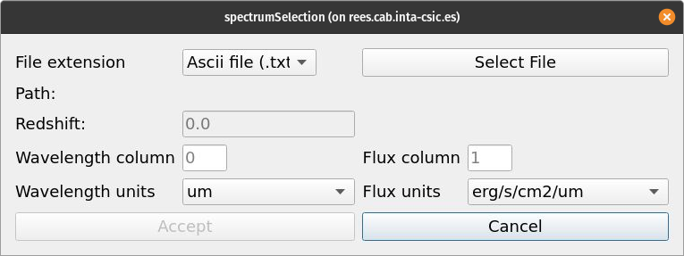

Once a file has been selected, several parameters can be modified (see :numref:`figure2`):

* The redshift that is going to be applied to both values after they have been transformed, if necessary
* The columns where the values are. By default, the wavelength and flux column are located in column 0 and column 1 respectively.
* The units both columns are in order to transform into 'erg/cm2/s/um' and 'uj'.

.. _figure2:
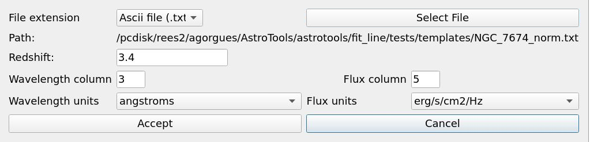

Spectrum interaction
---------------------

Once the spectrum is seleced in the previous window and it's parameters applied, this willl be represented on the main window with all the buttons avaliable.

.. _figure3:
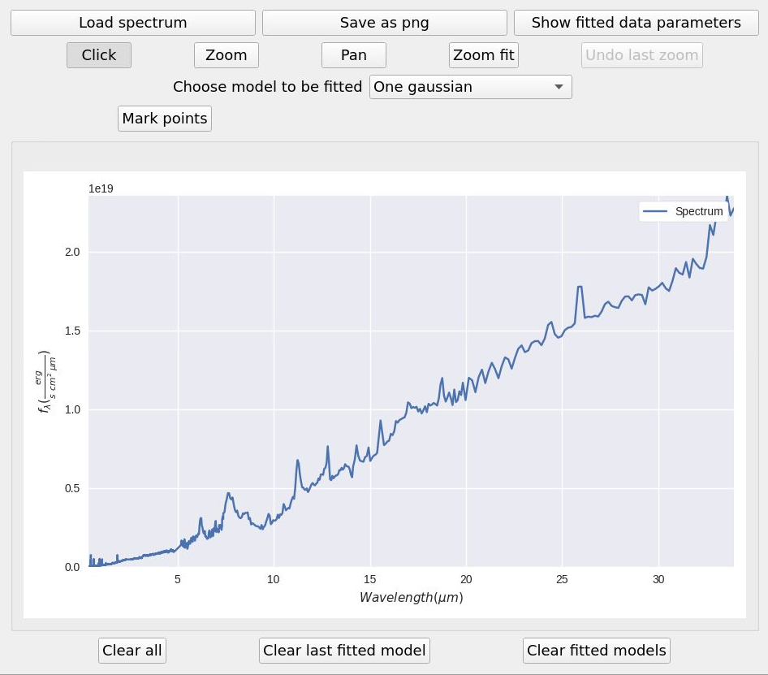

To interact with the spectrum in order to investigate in what are the gaussian or gaussians fitted models will be applied, several options are avaliable.

* Pressing the "click" button, will deactivate all possibility to zoom or pan the spectrum representation.
* Pressing the "zoom" button allow to "zoom in" and "zoom out" the representation, selecting the rectangle area that is going to be "zoomed" or "zoomed out", pressing the left or right button, respectively.
* Pressing the "pan" button allows to move, pressing the left button, the spectrum to the desired area.
* Pressing the "zoom fit" button will centre the visualization to the initial bounds values of the spectrum.
* Pressing the "undo zoom" button will undo the previous zoom actuon made, with the possibility to undo all zoom actions recursively. The pan actions are not taken in count in this undo option.

Gauss fitted model creation
----------------------------

The main feature is the possibility to create multiple gauss fitted models along the spectrum visualization.

First of all the model that is going to be used to make the fitted models need to be selected from the list that is in the middle of the button area (see :numref:`figure5`).

.. _figure5:
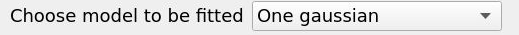

Once the model has been selected, to create each gauss fitted model, the "mark points" button need to be pressed, after that, different parameters,up to eight, need to be obtained, to get the fitted model, these parameters will be updated after double clicking on a selected point for each one.

To know which parameter is going to get it's values, a label above the canvas will appear indicating it, as shown in :numref:`figure6`.

.. _figure6:
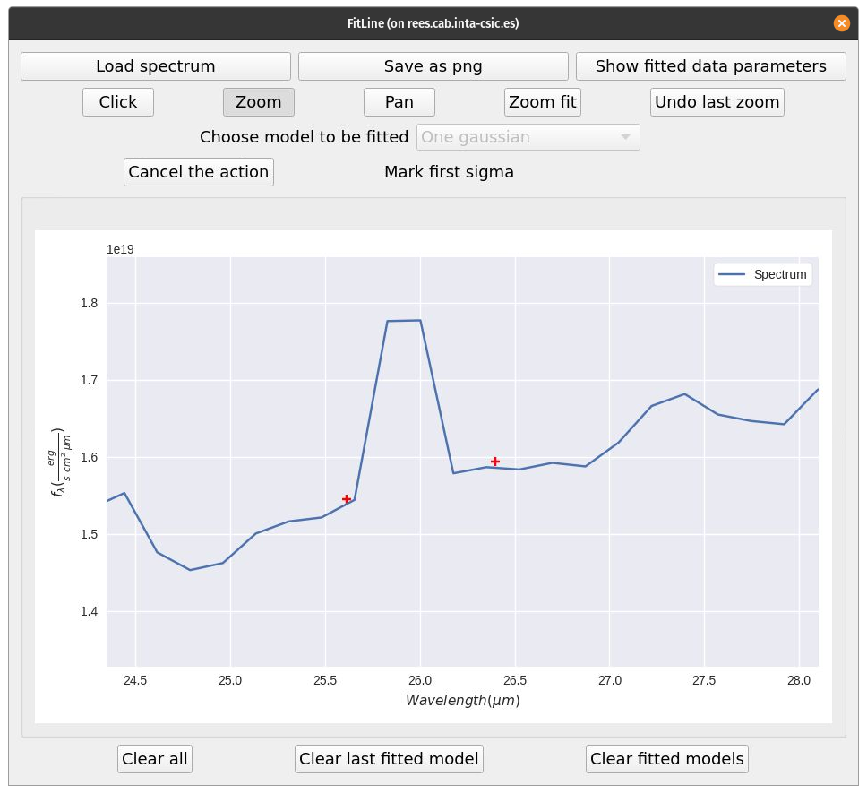

If the model that is being made is not the right one, or if a new model wants to be created, the same button that creates it, can be clicked to perform these actions.

Gauss fitted model results
---------------------------

After all five or egith points have been selected, different figures will appear on the canvas:

* Initial fit figure(s): Models where for each X value, the Y values are the result of applying the initial parameters values to it on each gaussian model.
* Best fit figure: The resulting gaussian fitted model from the function specified.
* Gausss fited model figure(s): Representation of the gaussian fitted models for each gaussian assigned.
* Line fitted model figure: Representation of the line fitted model.

.. _figure7:
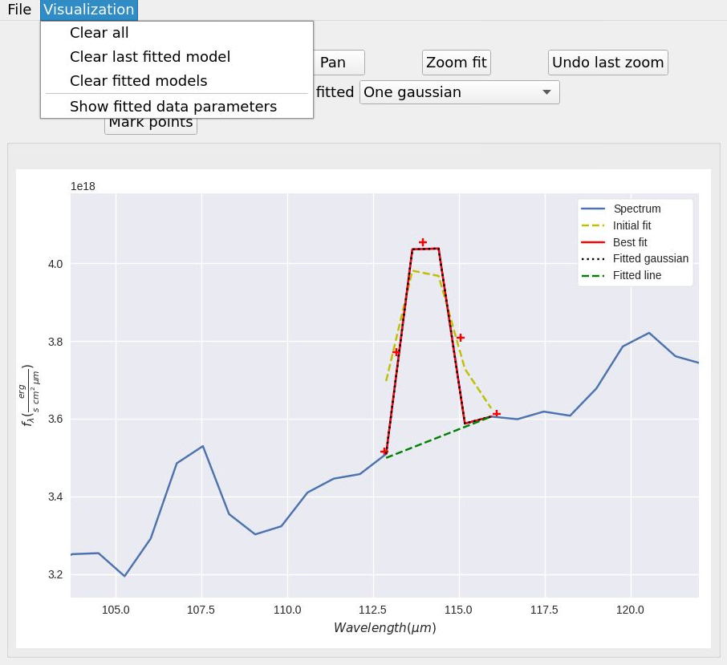

Erase options
--------------

At the bottom of the main window, several buttons allow to perform different erase options (see :numref:`figure8`):

* Pressing the "Clear all" will delete all the models and spectrum figure, which disable all the buttons except for the one that load the spectrum.
* Pressing the "Clear fitted models" will delete only the modelas and all it's data.
* Pressing the "Clear last model" will delete only the last model and it's figures that have been made

.. _figure8:
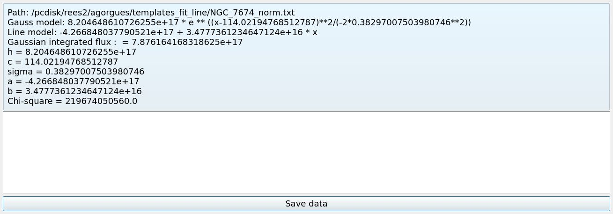

Gauss fitted model data
------------------------

After the spectrum figure has been drawn on the canvas, the "Data" button at the top right of the main window will be avaliable, however once clicked, it will show an empty list, with a button at the bottom of the new window. Once at least one fitted model has been made, several parameters will appear in the list, as it can be see in :numref:`figure9`:ç

* The gaussian and line fitted function with it's selected parámeters.
* The flux density value in (PONER DATO) for each gaussian fitted model.
* Each parameter selected that have been used to created the fitted model.
* THe chi-squared value.

.. _figure9:
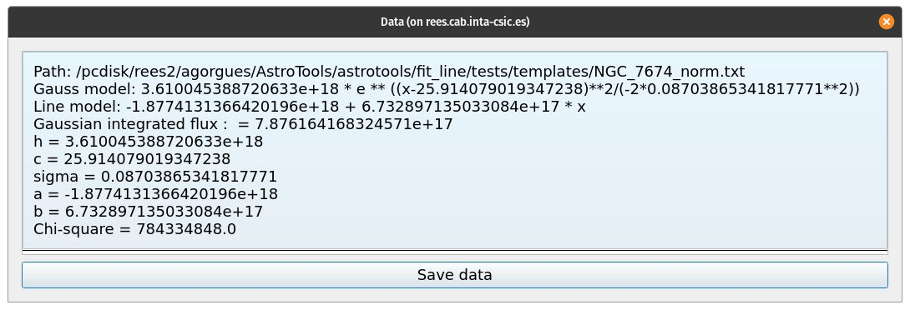

For each model that hass been created, it's parameters and fitted functions will appear on the new window.

Additionally, all the data can be saved on a txt with a capture of the current state of the spectrum representation as well as the residual comparsion representation of each model clicking the "Save data" button at the bottom of it.

Show residuals
--------------

For each fitted model, the residuals can be seen after double clicking in the model from the data list, which will made to appear a new window with two plots. Both plots will be represented along the X axis range of values selected in the model. THe first plot will show the spectrum along with the fitted model, and the second will show the residuales derivate from the spectrum and the fitted model values (see :numref:`figure10`).

.. _figure10:
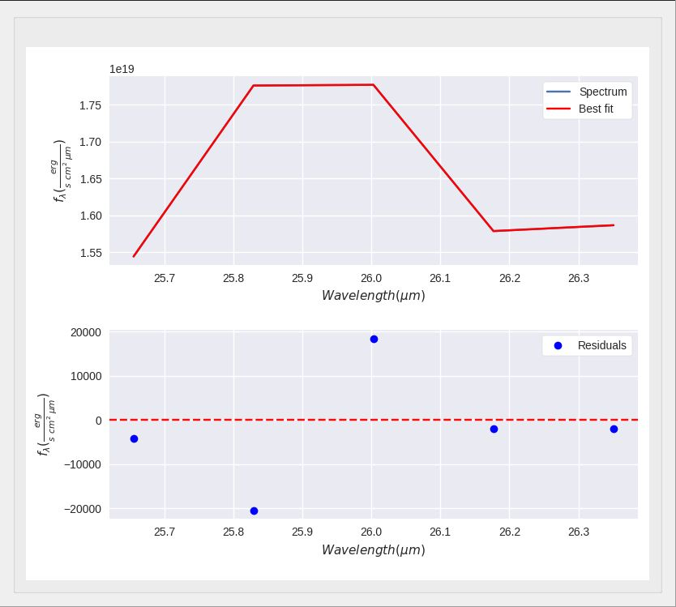

Both plots allow to zoom and pan with the mouse wheel and the left click as well as to be saved as a "png" file with the button located below them.

Save figure image
------------------

It's also possible to save only the current state of the canvas as a "png" clicking the "Save as png" button at the main window (see :numref:`figure11`).

.. _figure11:
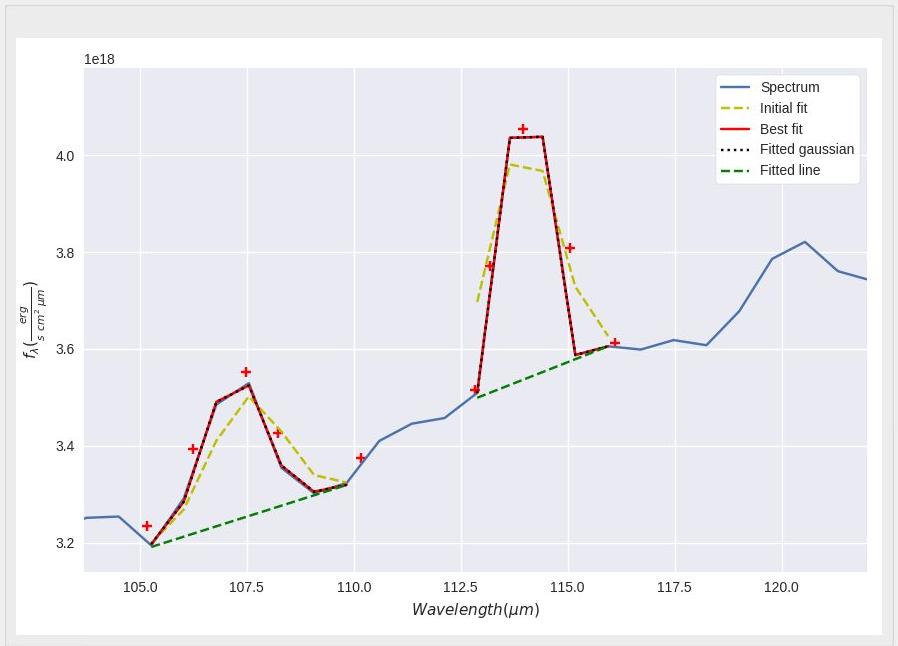

Examples
--------

Example 1
^^^^^^^^^

This example shows the data obtained after creating two models, for that, a figure of the spectrum has been loaded into the canvas from the filed added in the templates folder called "cumulo.txt", and after following the steps to create two models (see :numref:`example1`), the "See data" button has been clicked, whcih shows all parameres and fitted functions related to both models (see :numref:`example2`).

.. _example1:
.. figure:: _static/proj4-re9.png

.. _example2:
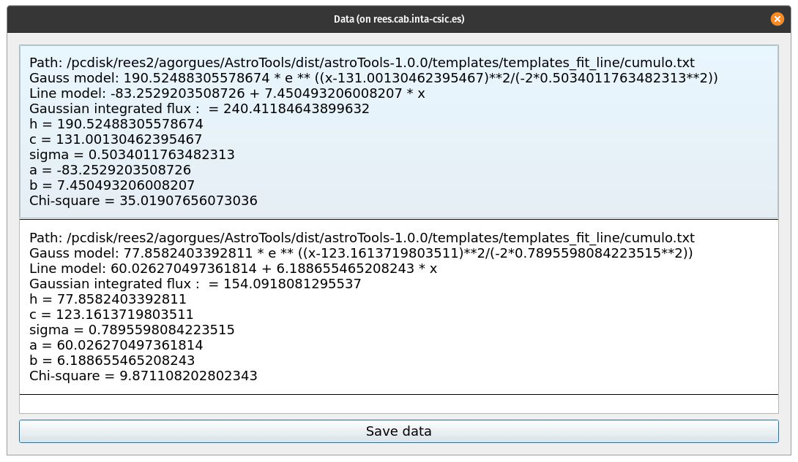

Example 2
^^^^^^^^^^

In this example, a double gaussian model has been selected to created the fitted one as it can be seen in :numref:`example3`.

.. _example3:
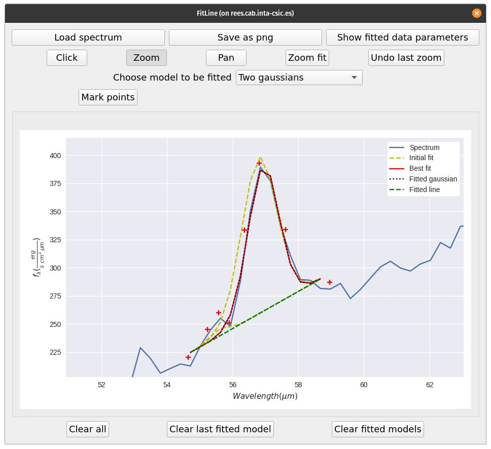

After the fitted models has been created, the data and the residuals can be seen (see :numref:`example5`) by double clicking on the data from the data list window in :numref:`example4`.

.. _example4:
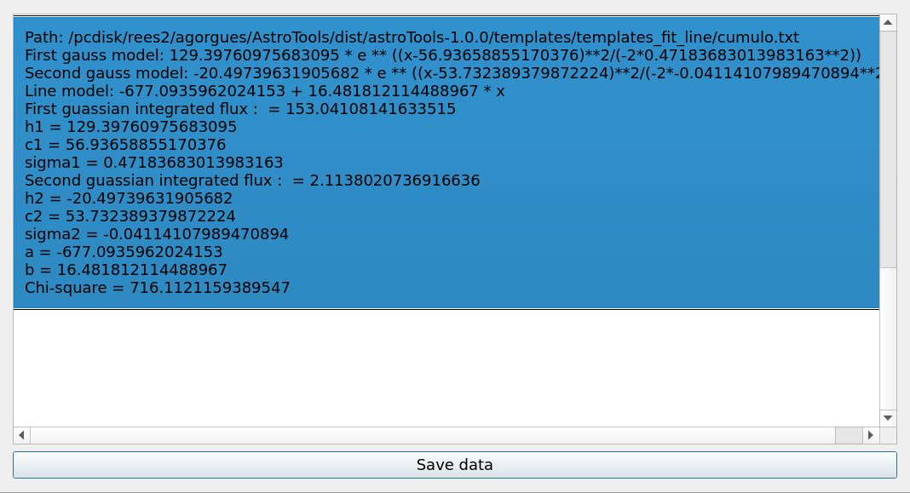

|

.. _example5:
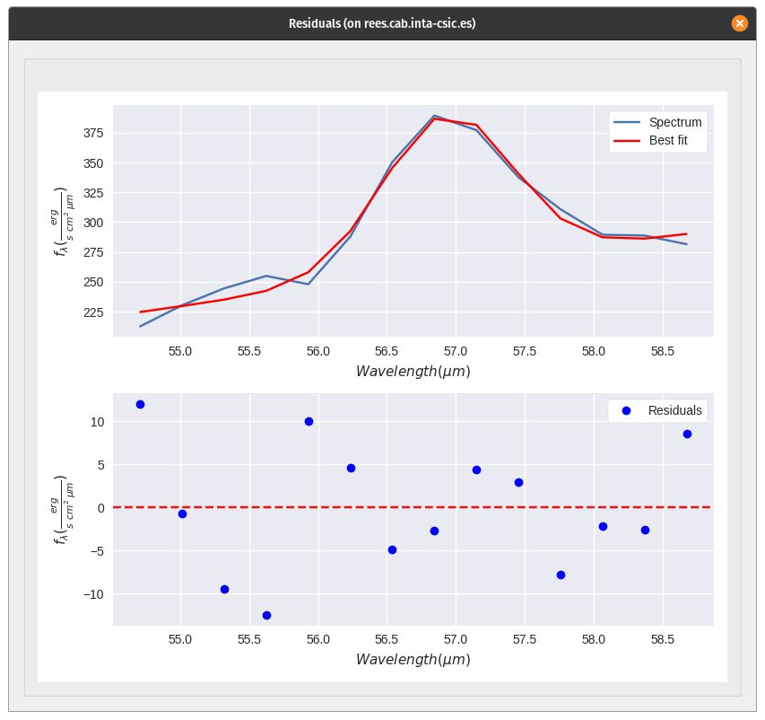
