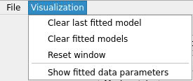
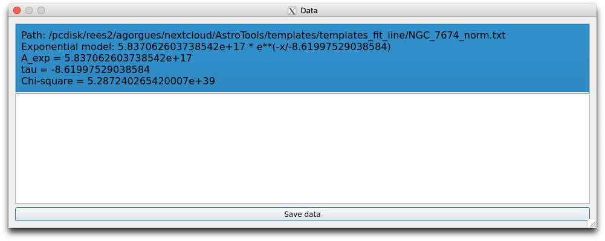

.. _fit_line_tutorial:

=================
Fit Line Tutorial
=================

--------
Overview
--------

Fit_Line allows to make multiple gaussian fitted models based on the spectrum loaded and represented. Once a model has been created, the parameters associated with the fitting model for each one can be seen and saved on a text file separately.

.. note::
        #. Only one spectrum can be loaded at the same time, this spectrum needs to accomplish the next structure to be able to be loaded:
        #. The spectrum file extension must be a text file or a fits file.
        #. The encoding of the file must be UTF-8.
        #. The wavelength and flux values must appear each one on two columns.

------------
Requirements
------------

To execute and use the too, the next libraries need to be installed:

* Python (tested for 3.8.0)
* Matplotlib (tested for 3.1.2)
* Numpy (tested for 1.81.1)
* PyQt5 (tested for 5.14.0)
* Seaborn (tested for 0.9.0)
* Lmfit (tested for 1.0.0)
* PyPubSub (tested for 4.0.3)

---------------
Initial display
---------------

After the tool is loaded, a window with a menu bar and multiple buttons on the top of it, will appear, which will interact with the spectrum on the canvas.

--------------
Data insertion
--------------

To be able to interact with the spectrum and to create gaussian fitted models, the first option called 'Load Spectrum', of the File button on the top left of the window need to be pressed, showing a new window which will allow to select the spectrum to be loaded and it's associated parameters that can be modified (see :numref:`figure1_fitLine`).

.. _figure1_fitLine:

Once a file has been selected, several parameters can be modified (see :numref:`figure2_fitLine`):

* The redshift that is going to be applied to both values after they have been transformed, if necessary
* The columns where the values are. By default, the wavelength and flux column are located in column 0 and column 1 respectively.
* The units both columns are in order to transform into :math:`erg/cm2/s/um` and :math:`uj`.

.. _figure2_fitLine:

--------------------
Spectrum interaction
--------------------

Once the spectrum is seleced in the previous window and it's parameters applied, the spectrum will appear on the main window with all the buttons avaliable.

.. _figure3_fitLine:

To interact with the spectrum in order to explore it, several options are avaliable.

* Pressing the "click" button, will deactivate all possibility to zoom or pan the spectrum representation.
* Pressing the "zoom" button allow to "zoom in" and "zoom out" the representation, selecting the rectangle area that is going to be "zoomed" or "zoomed out", pressing the left or right button, respectively.
* Pressing the "pan" button allows to move, pressing the left button, the spectrum to the desired area.
* Pressing the "zoom fit" button will centre the visualization to the initial bounds values of the spectrum.
* Pressing the "undo zoom" button will undo the previous zoom actuon made, with the possibility to undo all zoom actions recursively. The pan actions are not taken in count in this undo option.

---------------------------
Gauss fitted model creation
---------------------------

The main feature is the possibility to create multiple fitted models along the spectrum visualization.

With the two top middle buttons you can make different models along with the continuum model to be used (see :numref:`figure4_fitLine`)

.. _figure4_fitLine:

Once the model has been selected, to create each fitted model, the "mark points" button need to be pressed, after that, different parameters,up to eight, need to be obtained to get the fitted model, which will be updated for each point on double clicking.

To know which parameter is going to get it's values, a label above the canvas will appear indicating it.

If the model that is being made is not the right one, or if a new model wants to be created, the same button that creates it, can be clicked to perform these actions.

--------------------------
Fitted model results
--------------------------

After all points have been selected, different figures will appear on the canvas:

* Initial fit figure(s): Models where for each X value, the Y values are the result of applying the initial parameters values to it on each model.
* Best fit figure: The resulting gaussian fitted model from the function specified.
* Peak-like fitted model figure(s): Representation of the peak-like fitted models.
* Continuum fitted model figure: Representation of the continuum fitted model.

.. _figure6_fitLine:

-------------
Erase options
-------------

At the 'Visualization' button at the menu bar, several options appear to  allow to perform different erase options (see :numref:`figure7_fitLine`):

* Pressing the "Clear fitted models" will delete only the modelas and all it's data.
* Pressing the "Clear last model" will delete only the last model and it's figures that have been made
* Pressing the "Reset window" will delete all the models and spectrum figure, which disable all the buttons except for the one that load the spectrum.

.. _figure7_fitLine:

-----------------------
Fitted model data
-----------------------

After the spectrum figure has been drawn on the canvas, the 'Show fitted data parameters' option at the 'Visualization' button at the menu bar will be avaliable, however once clicked, it will show an empty list, with a button at the bottom of the new window. Once at least one fitted model has been made, several parameters will appear in the list, as it can be see in :numref:`figure8_fitLine`:

* The fitted functions with it's selected parámeters.
* The flux density value in erg/scm²um for each fitted model.
* Each parameter selected that have been used to created the fitted model.
* THe chi-squared value.

.. _figure8_fitLine:

For each model that hass been created, it's parameters and fitted functions will appear on the new window.

Additionally, all the data can be saved on a text file with a capture of the current state of the spectrum representation as well as the residual comparsion representation of each model clicking the "Save data" button at the bottom of it.

----------------------------------------------
Show residuals and save data from fitted model
----------------------------------------------

When you right click a model from the list, a menu with two options will appear. Selecting the first option, the residuals will come out in a new window with the possibility to zoom and pan with the mouse wheel, along with the option to save the plot as a.png file pressing the button located below them (see :numref:`figure9_fitLine`). Selecting the second option, the best fitted model data will be saved.

.. _figure9_fitLine:

-----------------
Save figure image
-----------------

It's also possible to save only the current state of the canvas as a "png" clicking the "Save as png" button at the 'File' menu option (see :numref:`figure10_fitLine`).

.. _figure10_fitLine:

--------
Examples
--------

^^^^^^^^^
Example 1
^^^^^^^^^

This example shows the data obtained after the creation of two models, for that, a figure of the spectrum had been loaded into the canvas from the file added in the templates folder called "NGC_7674_norm.txt", and after following the steps to create the models, being the left one a lorentz with a continuum model, and the right one a gaussian with a continuum model, the result can be seen in the figure below (see :numref:`example1_fitLine`).

.. _example1_fitLine:

^^^^^^^^^
Example 2
^^^^^^^^^

In this example, an exponential model had been selected to created the fitted one, using the same sprectrum, as it can be seen in :numref:`example2_fitLine`.

.. _example2_fitLine:

After the fitted models was created, the data and the residuals can be seen (see :numref:`example4_fitLine`) by double clicking on the data from the data list window in :numref:`example3_fitLine`.

.. _example3_fitLine:

|

.. _example4_fitLine:

