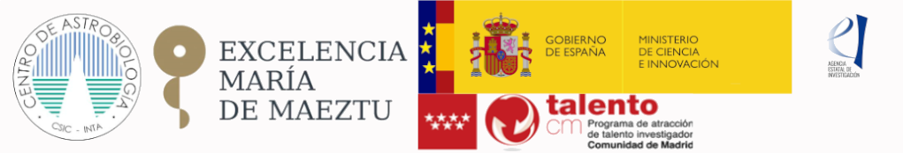

========================
Welcome to AstroCabTools
========================

Set of tools that analize data from JWST in Python

Current version is |release|

.. _GitHub: https://github.com/AlejandroGorgues/AstroCabTools

Acknowledgment
===============

This work has been partially funded by the Ministerio de Ciencia e Innovación through its program “promoción de empleo joven e implantación de la Garantía Juvenil en I+D+i 2018, PEJ2018-002877-A”, the Comunidad de Madrid through the Atracción de Talento grant 2017-T1/TIC-5213, and he Spanish State Research Agency (AEI) Project MDM-2017-0737 Unidad de Excelencia “María de Maeztu”- Centro de Astrobiología (CSIC-INTA).

Key Features
============

* Integrate processing tools, algorithms, visualizationd and data analyisis of images and 3D infrarred spectroscopy for the James Webb Espacial Telescope (JWST).
* Integration of JWST calibrated data and advance products into astronomic data bases and astrophisics specialized packages.
* Developing of procedures to the JWST data combination and the joint analyisis of large volumes of data.
* Simulation and study of observations made from the MIRI tool of the JWST with the MIRISim simulator.

Libraries Used
==============
* `PyQt <https://wiki.python.org/moin/PyQt>`_ - Binding of C++ GUI library.
* `Numpy <https://numpy.org/>`_ - Library that allow large data manipulation in python.
* `Matplotlib <https://matplotlib.org/>`_ - Grpah visualization library.
* `Astropy <https://www.astropy.org/>`_ - Collection of software packages used for astronomy.
* `Seaborn <https://seaborn.pydata.org/>`_ - Statistical data visualization.
* `Lmfit <https://lmfit.github.io//lmfit-py/>`_ - Non-Linear Least-Squares Minimization and Curve-Fitting for python.
* `PyPubSub <https://github.com/schollii/pypubsub/>`_ - Package that provides a publish-subscrive API.

Tools Installation
====================

The set of tools can be downloaded using the next pip command:

.. code-block:: bash

       $ pip install AstroCabTools

Tools execution
=================

all_tools execution:

.. code-block:: bash

       $ allTools

mrs_chan execution:

.. code-block:: bash

       $ bandChan

mrs_spec_chan execution:

.. code-block:: bash

       $ specChan

mrs_det_plot execution:

.. code-block:: bash

       $ detPlot

fit_line execution:

.. code-block:: bash

       $ fitLine

Tutorials
=========

#. :ref:`mrs_chan_tutorial`

#. :ref:`mrs_spec_chan_tutorial`

#. :ref:`mrs_det_plot_tutorial`

#. :ref:`fit_line_tutorial`

#. :ref:`all_tools_tutorial`

Authors and License
===================

The ``AstroCabTools`` package is written mostly by Alejandro Gorgues and Alvaro Labiano.

It has a custom license.

Table of Contents
=================
.. toctree::
   :maxdepth: 2
   :name: mastertoc
   
   mrs_chan_tutorial
   mrs_spec_chan_tutorial
   mrs_det_plot_tutorial
   fit_line_tutorial
   all_tools_tutorial
