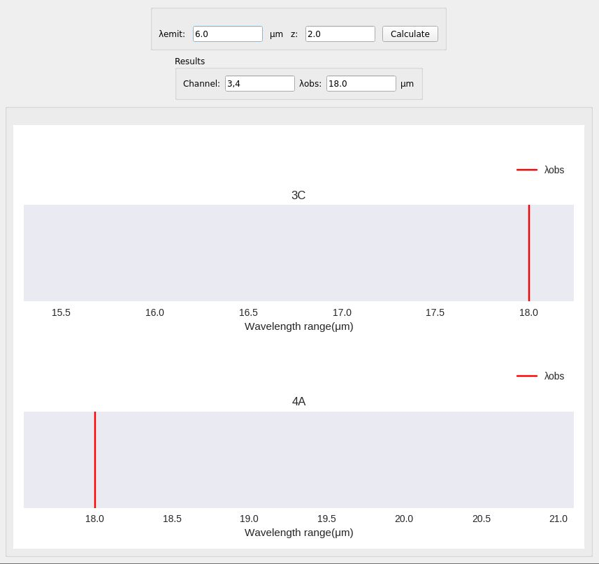
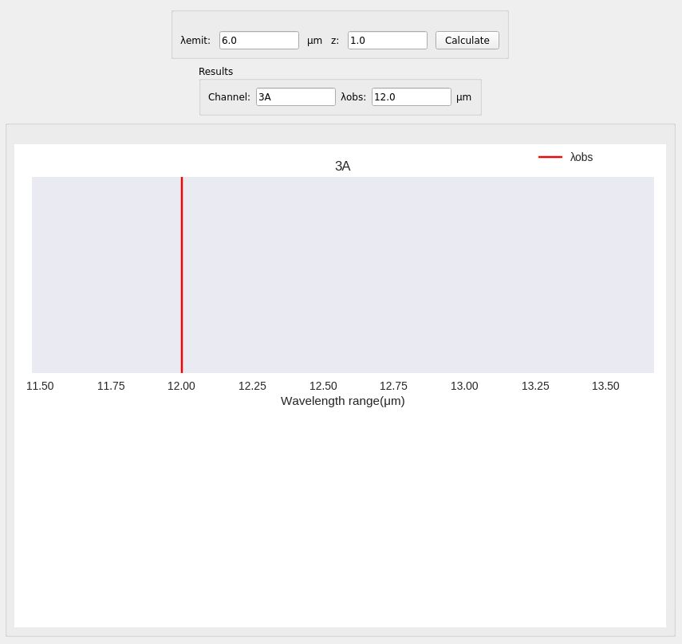

.. _mrs_chan_tutorial:

=================
Mrs_chan tutorial
=================

---------
Overview
---------
Mrs_chan transforms and represents a user given emitted wavelength (:math:`\mu m`) and redshift into an observed wavelength and the MRS sub-band where it will fall (using the ranges for sub-bands given in [1]_). The emitted wavelength is shifted into an observed wavelength using the standard Doppler effect transformation

.. math::

        \lambda_{obs} = \lambda_{emit}x(1 + z)

.. [1] `The Mid-Infrared Instrument for the JamesWebbSpaceTelescope, VI:The Medium Resolution Spectrometer <https://iopscience.iop.org/article/10.1086/682281/pdf>`_

------------
Requirements
------------
To execute and use the tool, the next libraries need to be installed:

* Python (tested for 3.8)
* Matplotlib (tested for 3.1.2)
* Numpy (tested 1.8.1.1)
* PyQt5 (tested for 5.14.0)
* Seaborn (tested for 0.9.0)

--------------
Data insertion
--------------
To obtain the desired results, the values of the emitted wavelength and the redshift need to be know and inserted accordingly to the labels near the first two text boxes on top of the interface.

.. _figure1_mrsChan:

Once both values have been written, the "Calculate" button must be pushed in order to start the operations that will show where the observed wavelength is located.

.. _figure2_mrsChan:

-------
Results
-------
The results are shown in two different componentes:

#. Two text boxes that will print the list of sub band(s) where the observed wavelength itself as show in :numref:`figure3_mrsChan`.

.. _figure3_mrsChan:

#. A canvas where it will draw where the wavelength or wavelengths is located within the MRS sub bands. Based on the value specificacion for each channel from MRS, the wavelength will only be located on one or two sub bands.

--------
Examples
--------

On the first example, if an emitted wavelength and redshift values of 6.0 and 2.0 are inserted respectively, the observed wavelength which value is 18 will be situated in two subbdans (3C and 4A). THe output consists of two plots, each one associated with each sub band, which is shown in :numref:`example1_mrsChan`.

.. _example1_mrsChan:

On the second example, if the redshift value change from the first example from 2.0 to 1.0, the output consists of only one graph, according with the quantity of sub bands that the wavelength is in, which is 3A, shown in :numref:`example2_mrsChan`.

.. _example2_mrsChan:

