.. _mrs_det_plot_tutorial:

=====================
Mrs_det_plot tutorial
=====================

--------
Overview
--------

MRS_det_plot allows to move, zoom, change the scale and colour as well as the visualization of different ".fits" files up to four of them.

Each image derived form the ".fits" files, only shows the x, y and z values, however, more variables that comes along wirh the fits files are taken in count to make it possible to manipulate it, which are:

#. Information about the type of data inside the matrix: BUNIT.
#. Size of each parameter that allows to obtain the data of the matrix (Because the type of the ".fits" file is going to be the same, there is no need to look for the number of the dimensions of the image): NAXIS1, NAXIS2, NAXIS3, NAXIS4.
#. Initial position of each parameter on the image: CRVAL1, CRVAL2, CRVAL3.
#. Type of parameter (It's possible that the frame and integration positions could exchange themselves): CUNIT1, CUNIT2, CUNIT3, CUNIT4.
#. Increment of each parameter on the image in order to obtain the data on each pixel: CDEL1, CDELT2, CDELT3

------------
Requirements
------------

To execute and use the tool, the next libraries need to be installed:

* Python (tested for 3.8)
* Matplotlib (tested for 3.1.2)
* Numpy (tested for 1.81.1)
* PyQt5 (tested for  5.14.0)
* Seaborn (tested for 0.9.0)

---------------
Initial display
---------------

After the tool is loaded, two windows will appear. The first window shows different elements that will interact with the four images that are going to be displayed on the second window and will be explained in the next section.

--------------
Data insertion
--------------

To be able to manipulate different images, a ".fits" file needs to be selected. For each one of the images that are going to be drawn into the canvas of the second window, there are four buttons that allows to load them. Once clicked one of them, a file directory window will appear to select the ".fits" file that wants to be selected, this would change it's current representation on the canvas (see :numref:`figure1_mrsdetPlot`).

.. _figure1_mrsdetPlot:
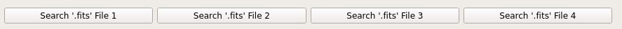

------------------
Image manipulation
------------------

^^^^^^^^^^^^^^^^^^^
File representation
^^^^^^^^^^^^^^^^^^^
Each image is going to be represented on the second window on a specific position as show in :numref:`figure2_mrsdetPlot`.

.. _figure2_mrsdetPlot:
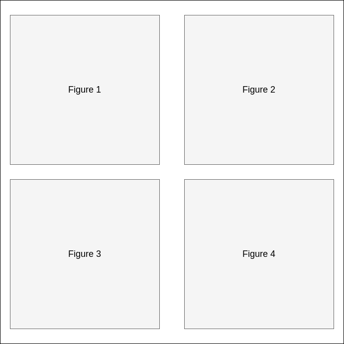

^^^^^^^^
Colorbar
^^^^^^^^

After an image has been loaded, a colorbar will appear on the main window. This colorbar will change it's range once the mouse pass over one an image avaliable, and it's colours when the scale or stretch or colour of the image change.

.. _figure3_mrsdetPlot:
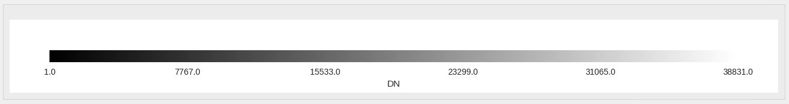

^^^^^^^^^^^^^^^^^^^^
Image loading window
^^^^^^^^^^^^^^^^^^^^

In case the window that shows all four images has been closed, the main window provide a button with the text "Show '.fits' images" that will allow to show the images window again.

^^^^^^^^^^^^^^^^^^^^^^^^^^^^^^^^^^^^^
Frame and integration updating values
^^^^^^^^^^^^^^^^^^^^^^^^^^^^^^^^^^^^^

Because there are four images on the main window, the values of each one can be change independently with their corresponding interaction in it's group of componentes, corresponding the farthest to the left to the first image.

For each image, the frame and integration values can be modify moving the corresponding sliders to the left or the right as well as modifying the text fields located to the left of each slider pressing them with the "Enter" key to change it (see :numref:`figure4_mrsdetPlot`). To change other image, it's equivalent elements need to be used.

.. _figure4_mrsdetPlot:
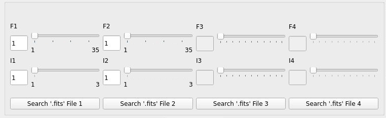

^^^^^^^^^^^^^^^
Pixel selection
^^^^^^^^^^^^^^^
Double clicking on a pixel from an image will draw a cross with the pixel clicked as the center of it (see :numref:`figure5_mrsdetPlot`), update the X, Y and Z text fields associated to the image at the bottom of the main window (see :numref:`figure6_mrsdetPlot`), and enable the two buttons to the right of the text fields that will allow respectively to:

#. Show a new window with two plots related to the flux values along the X and the Y axis of the pixel selected (see :numref:`figure7_mrsdetPlot`).

#. Show a new window with one plot related to the flux values along time (see :numref:`figure8_mrsdetPlot`).

Each one of the window shave three aditional features:

* Zoom the plots to inspect them.
* Move around the plots to inspect them.
* Save the plots as ".png" files with the button located below the plots.

In any case new pixels need to be selected, by double clicking again on the one selected, will update both the image and it's corresponded text fields.

|

.. _figure5_mrsdetPlot:
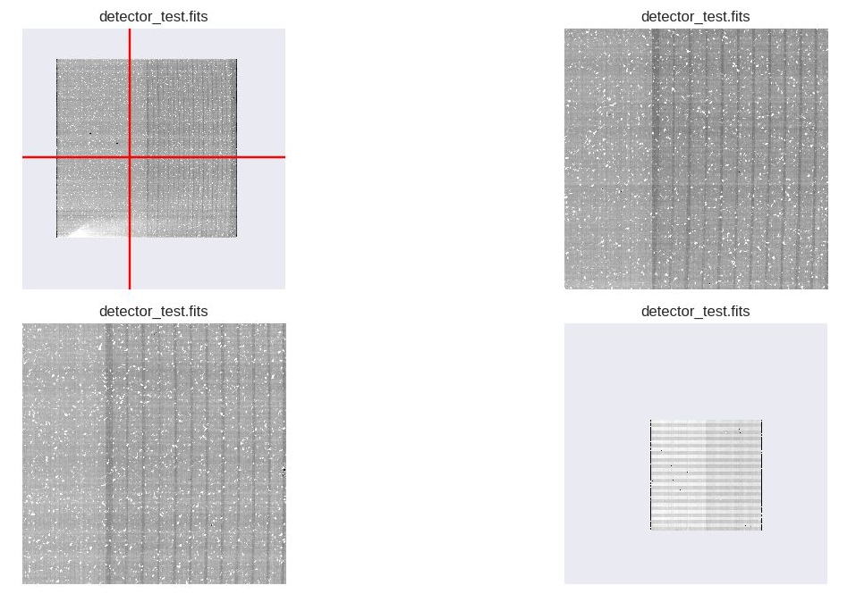

|

.. _figure6_mrsdetPlot:
.. figure:: _static/mrsDetPlot/proj3-re16.PNG

|

.. _figure7_mrsdetPlot:
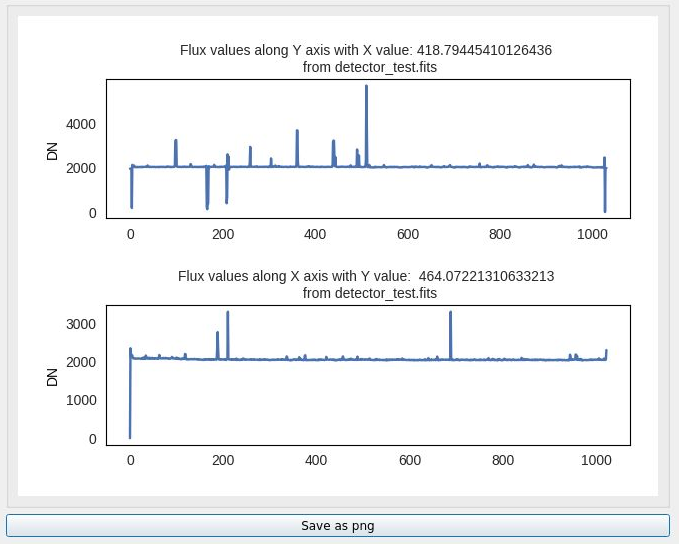

|

.. _figure8_mrsdetPlot:
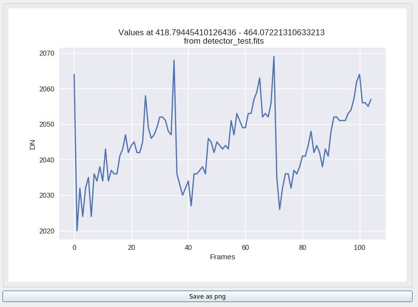

^^^^^^^^^^^^
Zoom and pad
^^^^^^^^^^^^

The image can be zoomed and padded individually using the wheel and left click of the mouse respectively.

^^^^^^^^^^^^^^^^^^^
Additional features
^^^^^^^^^^^^^^^^^^^

Given all the images, some characteristics, that will affect all of them at the same time, can be change:

#. Change the scale, stretch and colormap values. On top of the right of the interface, multiple fields are stacked in a tabbed component:
        * The first page is related to the possibility to change the scale of the image obtaining different range of values applying "minmax" or "zscale" scale as well as the possibility to change the stretch as "linear", "log", or "sqrt".

        * The second page is related to the possibility to change the colormap of the images from different types of colormaps ("gray", "colorwarm", "Accent", "gist_heat", "rainbow").
        * The third page does not add a new modification ot the images, but it allows the user to fit the images to the original value of it.
#. Fit all the figures. Pressing the "zoom fit" button will center each image on each corresponding space given initially.

.. _figure9_mrsdetPlot:
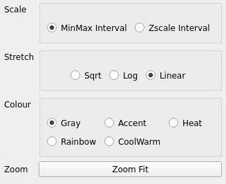

--------
Examples
--------

On the first example, four ".fits" files (see :numref:`example1_mrsdetPlot`) have been loaded. After loading them, the interval has been changed to zscale, the scale to Sqrt and the frame and integration values of each one respectively to 14 and 2, 26 and 1, 1 and 2, 27 and 3 (see :numref:`example2_mrsdetPlot`).

.. _example1_mrsdetPlot:
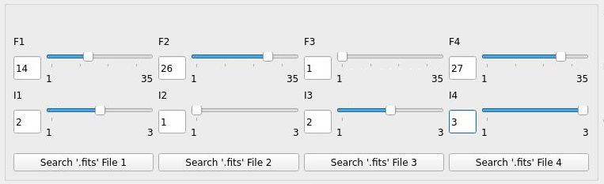

|

.. _example2_mrsdetPlot:
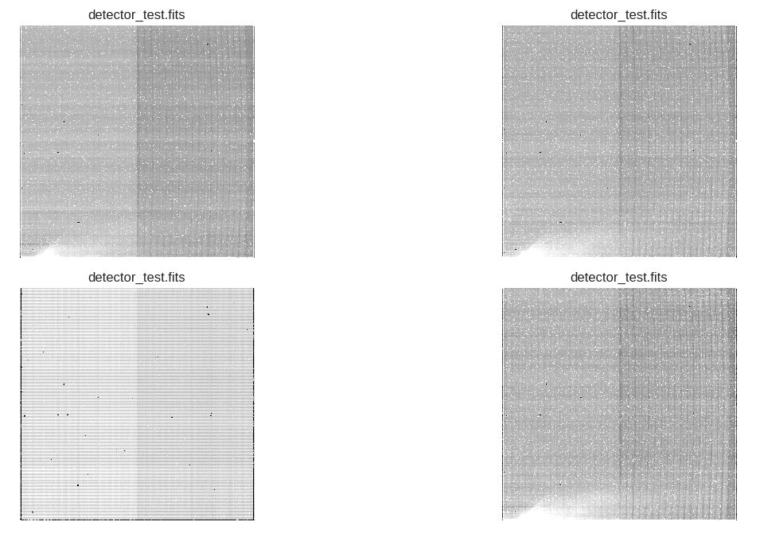

On the second example based on the first example, a pixel has been selected for each one of the images (see :numref:`example3_mrsdetPlot`), showing the values of the pixels at the bottom of the interface (see :numref:`example4_mrsdetPlot`).

.. _example3_mrsdetPlot:
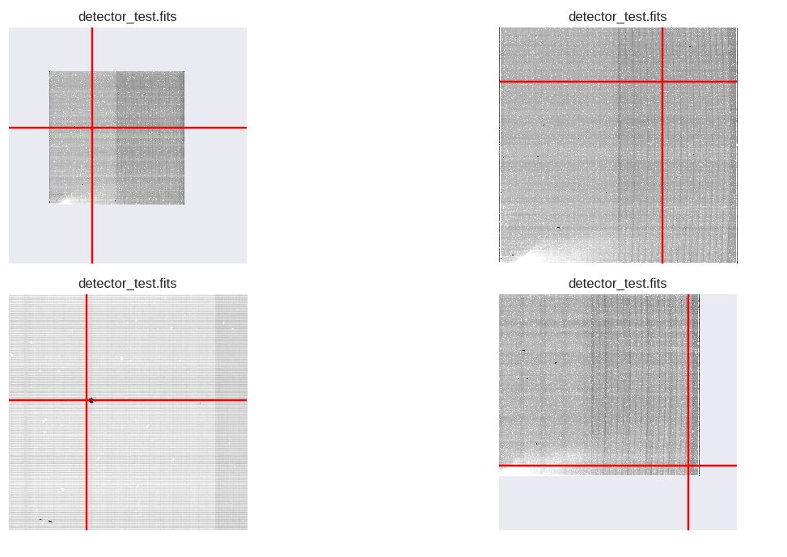

|

.. _example4_mrsdetPlot:
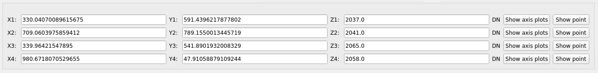
