.. _mrs_spec_chan_tutorial:

======================
Mrs_spec_chan tutorial
======================

--------
Overview
--------

Mrs_spec_chan transform and represent into a plot the relationship between an emitted wavelength (:math:`\lambda_{emt}`) and its associated flux (:math:`uJy`), being the second functionalities:

* Represent multiples relationships from the same spectrum or diferent ones as well as to be able to hide or show them.
* Know in which of the MIRS sub bands, NIRSpec IFU ranges and NIRS gaps, the relationship falls.
* Know which of the different lines of interest matches the relationship.
* Represent specific spectrums.

To make the emitted wavelengths avaliable to be characterized from the different sub bands as well as to compare it with the flux on the same plot:
* Both values must be shifted into an observed wavelength(lambda obs= and it associated flux with the value of a redshift(z).
* The flux value must be normalized, in this case, based on the closest value to 10 microns.

------------
Requirements
------------

To execute and use the tool, the next libraries need to be installed:

* Python (tested for 3.8)
* Matplotlib (tested for 3.1.2)
* Numpy (1.81.1)
* PyQt5 (5.14.0)
* Seaborn (0.9.0)

--------------
Data insertion
--------------

^^^^^^^^^^^^^^^^
Spectrum loading
^^^^^^^^^^^^^^^^

To use all the options that the tool as, an spectrum or spectra need to be loaded and represented clicking on the "Load spectra" button in :numref:`figure1_mrsSpec`.

.. _figure1_mrsSpec:
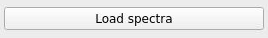

Once it has been clicked, a new window will appear. On this window, the "Select Directory" button must be pressed, allowing to select the directory where the spectra that are going to be loaded are (see :numref:`figure2_mrsSpec`). Once a directory has been selected, it will appear a list that corresponds to the ".txt" files that are assumed to be the spectra, however only the files that have the format described in :ref:`Overview` will be able to load.

.. note::

        Each ".txt" item from the lsit is composed of:

        * A disabled checkbox that will allow to include the spectrum on the list that will be loaded if it's checked or not.
        * A text field, that will neable the checkbox element and corresponds with the redshift value that will be applied to the spectrum associated with it.
        * A label that shows the path of the ".txt" file.

.. _figure2_mrsSpec:
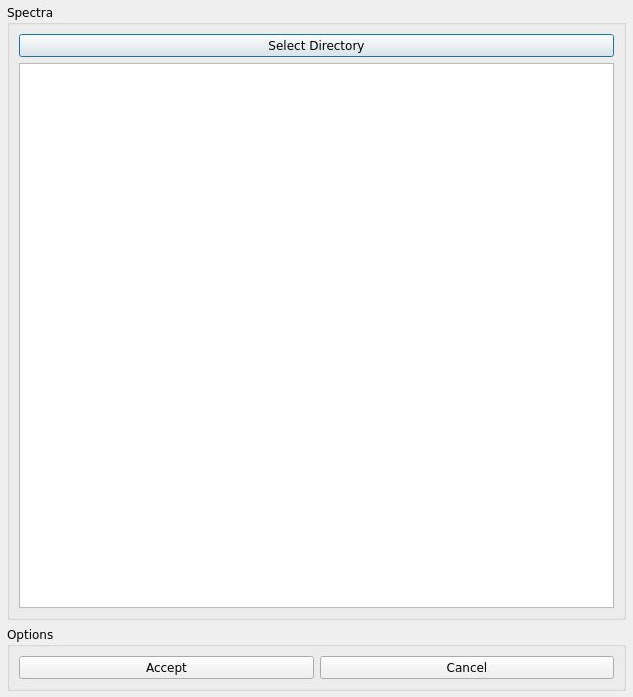

Because the specturm is added to the list of the ones that are going to be loaded once its corresponding checkbox has been checked, it's also possible to select different spectra from different directories pressing the "Select Directory" button again to change it.

Once the spectra have been selected, the user can click on the "Accept" button to load them or to click on the "Cancel" button to close it and remove the spectra selected if any have been selected (see :numref:`figure3_mrsSpec`).

.. _figure3_mrsSpec:
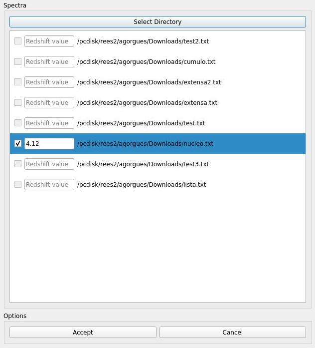

|

.. note::

        To be able to load the spectra, the ".txt" files must satisfy these requirements:

        #. Use UTF-8 encoding.
        #. Have only two columns separated with a space.
        #. The first column corresponds with the wavelength values.
        #. The second column corresponds with the flux values.

After finishing all changes, all the components on the main window will be enabled, and multiple elements that will be described on the next points will appear on the canvas.

^^^^^^^^^^^^^^^^^^^^^^
Spectrum visualization
^^^^^^^^^^^^^^^^^^^^^^

THe canvas represent amongst the sepctrum or spectram different elements:

#. The MRS sub bands, show as rectangles of different color that overlap each other based on the values that corresponds to them as well as text that indicate which rectangle corresponds to which sub band.
#. The NIRSpec IFU ranges, show most of them as rectangles of different color. Because on the of them covers not also all the NIRSpec IFU ranges but also some of the MRS sub bands, is represented with two red vertical lines that marks the range.
#. The NIRSpec gap range of values represented as vertical lines. To simplifty the amount of values for each disperser, each range of vertical lines only represent the whole range for eeach dispereser.

In order to analyce the plot and each one of the elements, all the canvas can be zoomed in or out with the mouse wheel and move the plot after or before applying the zoom (see :numref:`figure4_mrsSpec`).

.. _figure4_mrsSpec:
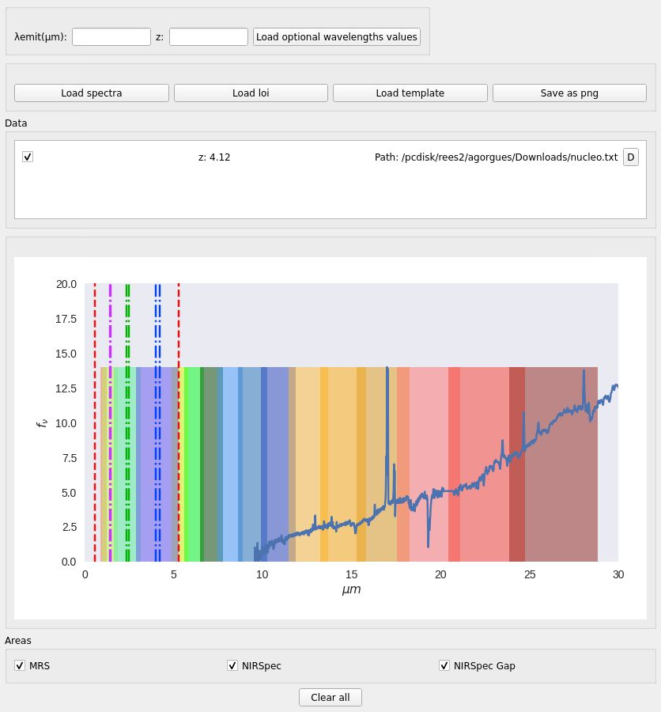

^^^^^^^^^^^^^^^^^
Channel selection
^^^^^^^^^^^^^^^^^

To observe specific elements, the tool provides the options to show and hide each one of them using the checkboxes located at the bottom of the main window.

Once the spectra have been loaded, all checkboxe are selected by default, however, if one of the is unchecked, the once associated, will hide on the canvas. In :numref:`figure5_mrsSpec`, the MRS sub band has been unchecked as an example.

.. _figure5_mrsSpec:
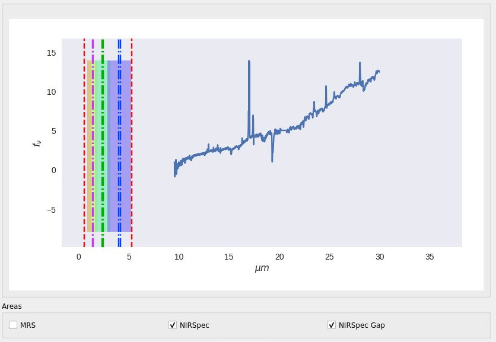

^^^^^^^^^^^^^^^^^^^
Spectrum management
^^^^^^^^^^^^^^^^^^^

THe posibility to hide the elements, as show in the last header, also applies to the spectra, which can be hidden.

Above the canvas,it appears a component that correspond to a list element, which shows all the spectra selected with its corresponding redshift, but not only shows them, they can be hidden and removed from the specturm list (see :numref:`figure6_mrsSpec`), which mean that tom make them appear on the canvas, they mus be selected again. To give the possibility to do such options, two components were used:

* A checkbox, checked by default, that will show or hide the spectrum on the canvas.
* A button with a "D" letter that will delete the spectrum from the list and remove it from the canvas.

If all the spectra are deleted, all componentes will be disabled, and the canvas will be cleared.

.. _figure6_mrsSpec:
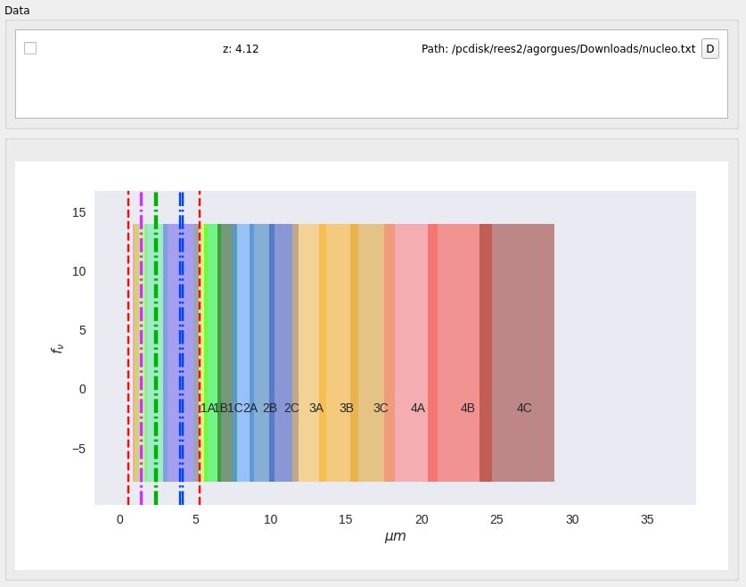

^^^^^^^^^^^^^^^^^^^^^^^^^^^^^^^^^^^^^^^^^
Optional wavelength values representation
^^^^^^^^^^^^^^^^^^^^^^^^^^^^^^^^^^^^^^^^^

Aside from the elements of the canvas, spcific wavelength values can be added after it's corresponded redshift is applied to each one. In order to add them, the wavelength values must be written on the text fields tht appear on the top of the main window separated with commas and the redshift that is going to be applied to each one respectively. After writting the values, if the button, to the right of the text fileds is clicked, will update the canvas with the new wavelengths, represented as pink vertical lines with its corresponding observed wavelength value on the top axis (see :numref:`figure7_mrsSpec`).

.. _figure7_mrsSpec:
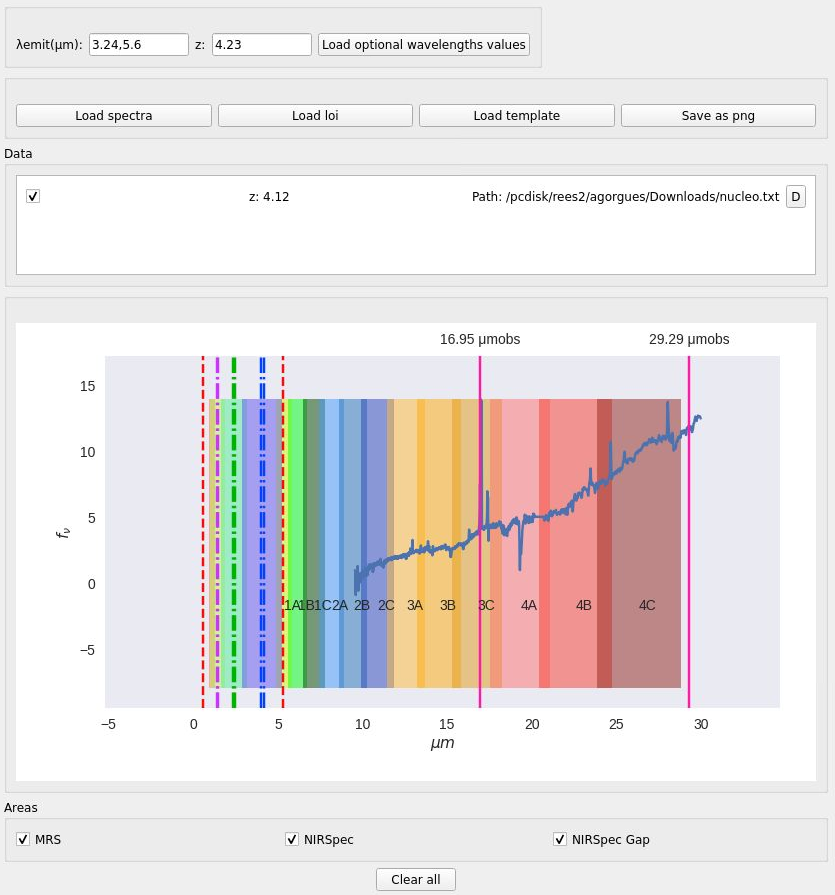

In case new spectra want to be loaded, the right button will need to be clicked to update the canvas.

^^^^^^^^^^^^^^^^^^^^^^^^^^^^^^^^
Lines of interest representation
^^^^^^^^^^^^^^^^^^^^^^^^^^^^^^^^

In connection with the optional wavelengths, multiples lines of interest can be selected to be shown in the canvas. To be able to select the items, first of all, the "Load loi" button need to be clicked, to appear a new window with a list of lines of interest items to be selected with the left checkbox on each one of them (see :numref:`figure8_mrsSpec`).

.. _figure8_mrsSpec:
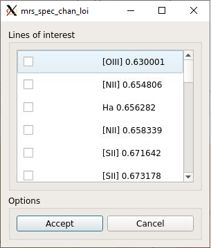

After accepting to load the lines of interest, each one of them will appear on a purple vertical lin with it's corresponding type on the top axis (see :numref:`figure9_mrsSpec`).

.. _figure9_mrsSpec:
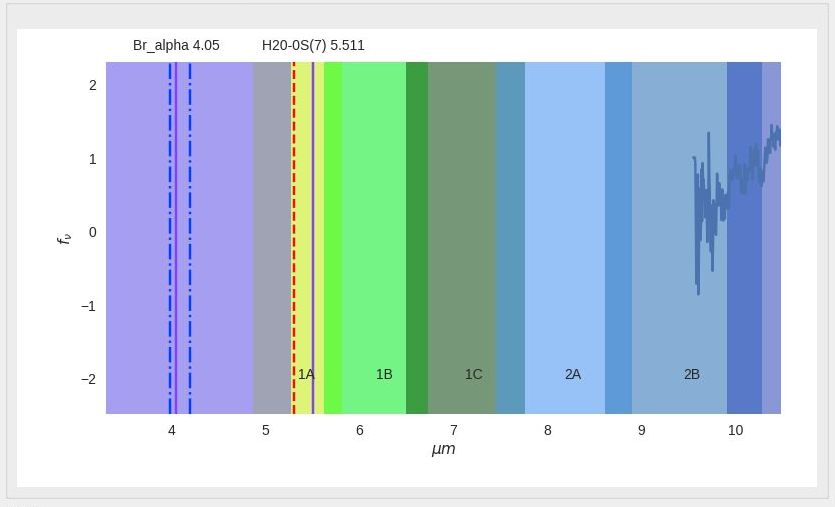

It's also possible to select or delete the current ones doing the same process in this subsection.

^^^^^^^^^^^^^^^^^^^
Save representation
^^^^^^^^^^^^^^^^^^^

The canvas can also be saved as a ".png" file clicking the "Save as png" button on the top of the main window.

.. _figure10_mrsSpec:
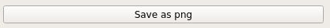

--------
Examples
--------

On the first example in :numref:`example1_mrsSpec`, multiple spectra have been loaded with different redshift for each one and only the MRS sub bands values to be shown.

.. _example1_mrsSpec:
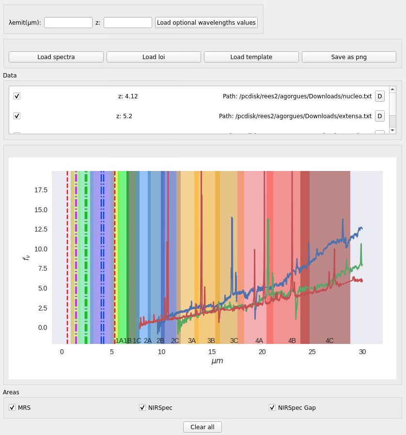

On the second, one spectrum has been loaded with the redshift value of 4.12, two optional wavelengths with a redshift value of 4.5 and two lines of interest, as show in :numref:`example2_mrsSpec`.

.. _example2_mrsSpec:
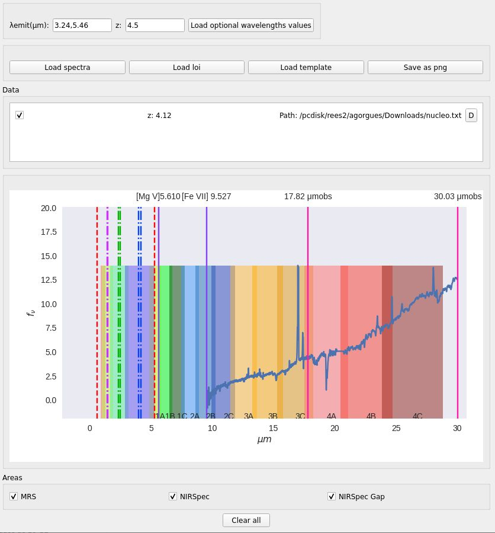
