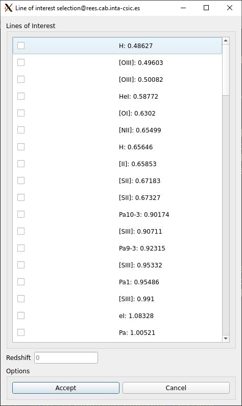
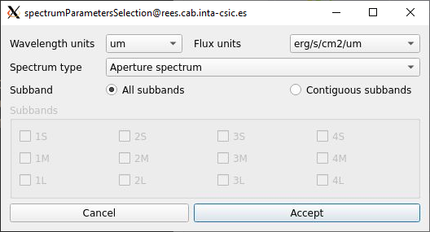

.. _mrs_sub_viz_tutorial:

Sub Viz Tutorial
=================

Overview
--------

Mrs_sub_viz allows to represent all the cubes from the four MRS Channels at the same time with the possibility to obtain the aperture, calculate the background or centroid from an area along all the cubes loaded, which can be all or some of the twelve cubes.

.. note::
        Only works with the MIRI Cube format

Requirements
-------------

To execute and use the too, the next libraries need to be installed:

* Python (tested for 3.8.0)
* Matplotlib (tested for 3.1.2)
* Numpy (tested for 1.81.1)
* PyQt5 (tested for 5.14.0)
* Seaborn (tested for 0.9.0)
* Lmfit (tested for 1.0.0)
* PyPubSub (tested for 4.0.3)
* Photutils (tested for 1.1.0)
* jwst (tested for 1.3.2)

Initial display
---------------

After the tool is loaded, a window with a menu bar and several buttons in it at the top of it will appear which will interact with the images on the canvas.

Data insertion
--------------

To be able to interact with the images the "Open" button in the "File" menu option on the top left of the window need to be pressed, showing a new window which will allow to insert the cubes in two different ways(see :numref:`figure1_mrs_sub_viz`):

1. Pressing the "Select directory" button which will allow to load an entire ".fits" directory, filter it by a file name if needed and assign automatically each cube on it's associated subband based on it's header. If there was data previously in the main window, all of it will be cleared.
2. Pressing the "Select .fits file" button which will allow to load a single ".fits" file and associated automatically by it's header or manually to a subband. If there was a cube in the subband where the new one will be assigned, it will delete it to add the new one, and in case there was any operation made previously, it will be done automatically to the new one.

.. _figure1_mrs_sub_viz:
.. figure:: _static/subViz/subViz_in1.PNG

.. _Image manipulation subViz:

Image manipulation
^^^^^^^^^^^^^^^^^^

Once the cube or cubes have been loaded, they can be manipulated independently or at the same time given the next possibilities in the "Tools" option in the menu bar (see :numref:`figure2_mrs_sub_viz`)

* The "Set current wavelength" option which allow to change the current slice of an specific cube selected. This process will be explained in the `Slice modification`_ section.
* The "interactive" option allow to use only the zoom, pan and zoom reset functionalities in a new window of a subband selected, explained in the `Interactive option`_ section
* The "Manage style" option allow to change the scale, stretch and color of one or all images at the same time.
* The "Rectangle aperture" and "Ellipse aperture" options allow to select an area based on the type of figure and make the aperture to obtain the associated spectrum allong all subbands. This complete process will be explained in the `Rectangle manipulation`_ and `Ellipse manipulation`_ sections.
* The "Creation of the rectangle parameterized" and "Creaton of the ellipse paremeterized" options allow to implement the aperture as the option before but in this case, the figure is created based on the pixel coordinates or sky coordinates inserted previously. This complete process will be explained in the `Rectangle manipulation`_ and `Ellipse manipulation`_ section.
* The "Rectangle coordinates" and "Ellipse coordinates" options allow to see the coordinates in pixels from an specific subband selected.
* The "Spectrum visualization" option allow to see, the spectra made from the aperture and background operations along each subband. This complete process will be explained in the `Spectrum visualization subViz`_ section.
* The "Background subtraction" option allow to obtain the spectrum as a result of the background subtraction from the aperture made initially with the annulus or rectangle aperture made through this process, whose complete functionality will be explained in the `Background subtraction subViz`_ section.
* The "Calculate centroid" option allow to compute the centroid from a selected subband along all subbands, whose complete process will be explained in the `Centroid functionalities`_ section.
* The "Show figure" option allow to change the aperture figure from rectangle to ellipse in case of neccesity.
* The "Get collapsed image" option allow to obtain the spectral sum along a wavelength range selected from an specific subband, whose complete process will be explained in the COLLAPSED section.
* The "Show centroid coordinates" option allow to obtain in pixel values, the coordinate of the centroid in a selected subband.

.. _figure2_mrs_sub_viz:

Slice modification
------------------

Once a subband has been selected from the top left list, the first slice, which corresponds to the first wavelength, will appear on the canvas(see :numref:`figure3_mrs_sub_viz`). Using the top components, the slice can be changed with:

* An slider that has a range determinated from the minimum and máximum value of the wavelength. Once it has been moved, the "Slice Value" spin, the "Wavelength Value" text edit field and the current image will changed with it's associated values based on the current wavelength, slice values and image index.
* An spin that can be used to changed to the slice that want to be shown. As told before, once this field change, the other components related will change too.
* A text field that can be used to change to the slice that want to be shown based on the approximated wavelength value. After this file change, the other componentes will change too.

.. _figure3_mrs_sub_viz:

Interactive option
^^^^^^^^^^^^^^^^^^
The second option will open a new window to manipulate the image from a subband selected, however not all the funcionalities are avaliable as this option only allow to manipulate with:

* The Unselect option which disallow the current option selected.

* The Zoom option allow to make zoom to the current image with the mouse wheel and maintain that zoom along all the slices

* The Pan option allow to move the current image with the left mouse button and maintain that shift alonw all the slices.

* The Zoom reset option allow to show the image as it was initially

* The Style option allow to modify the scale, stretch and color of the current image without affecting the image in the main window.

* The Save option allow to get the current image as a .png file.

.. _figure4_mrs_sub_viz:

Style manipulation
^^^^^^^^^^^^^^^^^^
The third option listed corresponds to the style which allows to change the scale, stretch and color of an specific subband selected from the list, or along all subbands, if the option located in the top right is pressed(see :numref:`figure5_mrs_sub_viz`):

.. _figure5_mrs_sub_viz:

Rectangle manipulation
^^^^^^^^^^^^^^^^^^^^^^
Related to the rectangle manipulation, three options can be selected, where all of them require to select a subband to interact with it:

1. The "Rectangle aperture" option allow to obtain the aperture spectrum associated to the rectangle area.
   After the option has been selected, the two top disabled buttons mentioned in the `Image manipulation subViz`_  will be active (see :numref:`figure6_mrs_sub_viz`) to allow to draw the rectangle figure along with the other options:
   1. The "Rectangle" button allow to draw the rectangle figure manually on the image.
   2. The "Make aperture" button allow to calculate the aperture based on the area of the rectangle. If a new aperture on another position wants to be made, simple move or create a new rectangle, and the press this button.
   Once the "Make aperture" button is pressed, not only the operation will be made in the current subband, but on all existent subbands. The results of the transformations coordinates of the rectangle figure and the aperture values as an spectrum for each subband will be represented in the main window and in a new window one respectively, whose functionality will be explained in the `Spectrum visualization subViz`_ section.
2. The "Rectangle Coordinates" option will show a new window that contains the X and Y coordinates of the left, right, top and bottom side of the rectangle from a selected subband, which will update when the figure change (see :numref:`figure7_mrs_sub_viz`).
3. The "Creation of Rectangle parameterized" option will allow to update or create in a new window the same rectangle figure as the one created in the first point given three possibilities:
   1. Create the rectangle with the center coordinates in pixels or in RA/DEC whose units are 00h00m00.00s, +/-00d00m00.00s respectively, and the width and height in pixels or arcsec.
   2. Create the rectangle calculating the centroid previously, whose process will be explained in the `Centroid functionalities`_ section,  to set the center of the rectangle as the coordinates of the centroid.
   3. Create the rectangle calculating the centroid previously.

   In all previous possibilities, the figure can be created or updated using the bottom left or the center coordinates along with the height and the width, which can be written in it's associated text fields. Once the parameters had been written, pressing the associated button given the type of coordinates located at the bottom of the window will update the coordinates of it (see :numref:`figure8_mrs_sub_viz`), and make the same process as the one described in the first point.

.. _figure6_mrs_sub_viz:

|

.. _figure7_mrs_sub_viz:

|

.. _figure8_mrs_sub_viz:

Ellipse manipulation
^^^^^^^^^^^^^^^^^^^^
Related to the ellipse manipulation, three options can be selected, where all of them require to select a subband to interact with previously:

1. The "Ellipse aperture" option, which allow to obtain the aperture spectrum associated to the rectangle area.
   After the option has been selected, the two top disabled buttons mentioned in the `Image manipulation subViz`_  will be active to allow to draw the ellipse figure along with the other options:
   1. The "Ellipse" button allow to draw the ellipse figure manually on the image.
   2. The "Make aperture" button allow to calculate the aperture based on the area of the ellipse. If a new aperture on another position wants to be made, simple move or create a new ellipse, and the press this button.
   Once the "Make aperture" button is pressed, not only the operation will be made in the current subband, but on all existent subbands. The results of the transformations coordinates of the ellipse figure and the aperture values as an spectrum for each subband will be represented in the main window and in a new window one respectively, whose functionality will be explained in the `Spectrum visualization subViz`_ section.
2. The "Ellipse Coordinates" option will show a new window that contains the X and Y coordinates of the top and bottom side of the ellipse, and the values in pixels of the major and minor axis  from a selected subband, which will update when the figure change.
3. The "Creation of Ellipse parameterized" option will allow to update or create in a new window the same ellipse figure as the one created in the first point given three possibilities:
   1. Create the ellipse with the center coordinates in pixels or in RA/DEC whose units are 00h00m00.00s, +/-00d00m00.00s respectively, and the axis in pixels or arcsec.
   2. Create the ellipse calculating the centroid previously, whose process will be explained in the `Centroid functionalities`_ section, to set the center of the ellipse as the coordinates of the centroid.
   3. Create the ellipse calculating the centroid previously.

   In all previous possibilities, the figure can be created or updated using the center coordinates along with the height and the width, which can be written in it's associated text fields. Once the parameters had been written, pressing the associated button given the type of coordinates located at the bottom of the window will update the coordinates of it, and make the same process as the one described in the first point.

.. _Spectrum visualization subViz:

Spectrum visualization
^^^^^^^^^^^^^^^^^^^^^^

After an aperture or background operation, spectra will appear, which corresponds to the represententation of each operation for each wavelength for each subband(see :numref:`figure9_mrs_sub_viz`).

Along with the spectra, top and bottom buttons will be able to be pressed to use different functionalities.

The top buttons corresponds with:
1. Zoom option, which allow to select a rectangle area with the left click on the plot to zoom in or right click to zoom out.
2. Pan option, which allow to move along the plot pressing and displacing the left click mouse button.
3. Zoom reset option, which allow to show the plot as it was initially
4. Select galaxy lines option, which allow to represent multiple galaxy lines from a list given its wavelength values where a redshift number can be applied to them (see :numref:`figure10_mrs_sub_viz`).

.. _figure9_mrs_sub_viz:

The bottom buttons corresponds with:

1. The "Save as png" button and "Save spectra as txt" button allows to capture in a PNG file the current plot and to get the spectra as a txt file that contains different columns depending on the number of spectra represented. The second file then can be used on the fit_line or quick_viz tool.
2. The "Load spectrum on fitLine" button allow to import directly a set of contiguous spectra selected from the range of the three avaliable into the fitLine  (see :numref:`figure11_mrs_sub_viz`).

.. _figure10_mrs_sub_viz:

|

.. _figure11_mrs_sub_viz:

.. _Background subtraction subViz:

Background subtraction
^^^^^^^^^^^^^^^^^^^^^^

Another feature is the possibility to obtain the spectra resulting from the subtraction of a background delimited parametrically from the spectrum of the aperture created manually. In order to delimite the area of the background the first aperture where corresponds to the rectangle or the ellipse figure need to have been drawn, and then an annulus or rectangle aperture will be created to implement the background operation. The position in pixels of both rings to perform the annulus aperture or the center coordinates along with the height and width pixel values of the rectangle aperture will be written in the next window after pressing the "Background subtraction" option in the menu (see :numref:`figure12_mrs_sub_viz`). As a result, this operation will be performed along all existing subbands, showing the result in the main window as another figure (see :numref:`figure13_mrs_sub_viz`), and two new spectra for each subband on the spectrumVisualization window, where the red one corresponds to the annulus aperture, an the green one to the background subtraction (see :numref:`figure14_mrs_sub_viz`).

.. _figure12_mrs_sub_viz:

|

.. _figure13_mrs_sub_viz:

|

.. _figure14_mrs_sub_viz:

Everytime the figure is moved or resized or changed (from rectangle, ellipse or the rings), the previous spectrums will change in order to adjust to the new values.

Centroid functionalities
^^^^^^^^^^^^^^^^^^^^^^^^
Calculating the centroid can be done pressing the "Calculate centroid" button or through the aperture process mentioned in the `Rectangle manipulation`_ and `Ellipse manipulation`_ section, which on both parts, it is required to follow these two steps once the subband where the centroid will be calculated is selected:

 1. Select the wavelength range to obtain the spectral sum through this range to visualize it in an image (see :numref:`figure15_mrs_sub_viz`).
 2. Select the rectangle are where the centroid will be calculated (see :numref:`figure16_mrs_sub_viz`).

.. _figure15_mrs_sub_viz:

|

.. _figure16_mrs_sub_viz:

Once the process has finished, the operation will be done for each existent subband, showing a red marker on each image, and the centroid coordinates in pixel values in a new window (see :numref:`figure17_mrs_sub_viz`).

.. _figure17_mrs_sub_viz:

Once a centroid has been calculated, it's associated pixel coordinates from a subband can be seen, pressing the "CENTROID COORDINATES" button (see :numref:`figure18_mrs_sub_viz`).

.. _figure18_mrs_sub_viz:

Collapsed image
^^^^^^^^^^^^^^^
Its also possible to obtain from a subband, the spectral range sum of it as an image through the "Get collapsed image" option in the "Tool" button. To get it, it is neccesary to select, from the subband where the image is going to be created, the wavelength range, this will generate the final image (see :numref:`figure19_mrs_sub_viz`) with the possibility to:

1. Reset the image to its original X and Y limits if the image have been zoom in or out with the mouse wheel.
2. Save the image as a .fits file.

.. _figure19_mrs_sub_viz:

Example
-------

This example shows the whole main process to load the background spectra from an small set of MRS galaxy cube files of one of the two directory that are inside the templates, into the fitLine tool.

To load the directory without any filter, first, the path of the directory must be selected pressing the “Select directory” button from the cubeLoader window, then, PRESSING the accept button will load each image to its associate subband (see :numref:`figure20_mrs_sub_viz`).

.. _figure20_mrs_sub_viz:

Once the directory has been loaded, the next part consists of getting the aperture from a specific area. To do that, it has been decided to use the rectangle figure as the aperture based on the parameterization process, using the centroid as the center of it, as shown in their process described below:

1. The “1L” subband is selected (see :numref:`figure21_mrs_sub_viz`).
2. The “Select all wavelength range” button is pressed for a better way to decide the area where the centroid is going to be calculated (see :numref:`figure22_mrs_sub_viz`).
3. The area where the centroid is going to be calculated is selected, pressing, and releasing the left mouse button on the rectangle area where approximately the center of the figure concurs with the center of the image.
4. Because the center coordinates in pixel values have been calculated from the centroid, the only remaining values are the height and width size of the rectangle, which in this case it has been decided to be written in pixel, whose values are 5 and 7 respectively (see :numref:`figure23_mrs_sub_viz`).
5. At the end, the rectangle figure has been drawn through all images and the spectra of all of them (see :numref:`figure24_mrs_sub_viz`), drawn in the spectrumVisualization window (see :numref:`figure25_mrs_sub_viz`).

.. _figure21_mrs_sub_viz:

|

.. _figure22_mrs_sub_viz:

|

.. _figure23_mrs_sub_viz:

|

.. _figure24_mrs_sub_viz:

|

.. _figure25_mrs_sub_viz:

Once the aperture spectra have been drawn, the next part consist of calculating the background subtraction from the rectangle figure using the annulus or rectangle aperture, which in this case it has been decided to use the annulus for better visualization. This process requires to select the “Background subtraction” button from the “Tools” option, and then writing the radius in pixel of the inner and outer rings, which in this example, have been set to 7 and 12 (see :numref:`figure26_mrs_sub_viz`).

.. _figure26_mrs_sub_viz:

The “Apply wedges background subtraction to each cube” button has been pressed, each of the images will be updated with its associated transformed annulus, and two new spectra for each spectrum will appear. Those two new corresponds to the mean flux value of the background for each wavelength with a red color, and the subtraction of the background aperture area from the initial spectrum with a green color (see :numref:`figure27_mrs_sub_viz`).

.. _figure27_mrs_sub_viz:

To load the fit_line tool, the “Load spectrum on fitLine” button from the previous window need to be pressed, which will show the last window associated to set the desired paramaters that are gonna be represented in the fit_line too. In this example, the spectra selected is the “Background subtracted spectrum”, the contiguous subbands selected are “1M” and “1L”, the redshift value has been set to 0.0 and the units of the wavelength and flux parameters to X and Y respectively (see :numref:`figure28_mrs_sub_viz`). After all actions have been made, the “Accept” button is pressed, and the fit_line tool appear, showing the final spectrum (see :numref:`figure29_mrs_sub_viz`).

.. _figure28_mrs_sub_viz:

|

.. _figure29_mrs_sub_viz:

